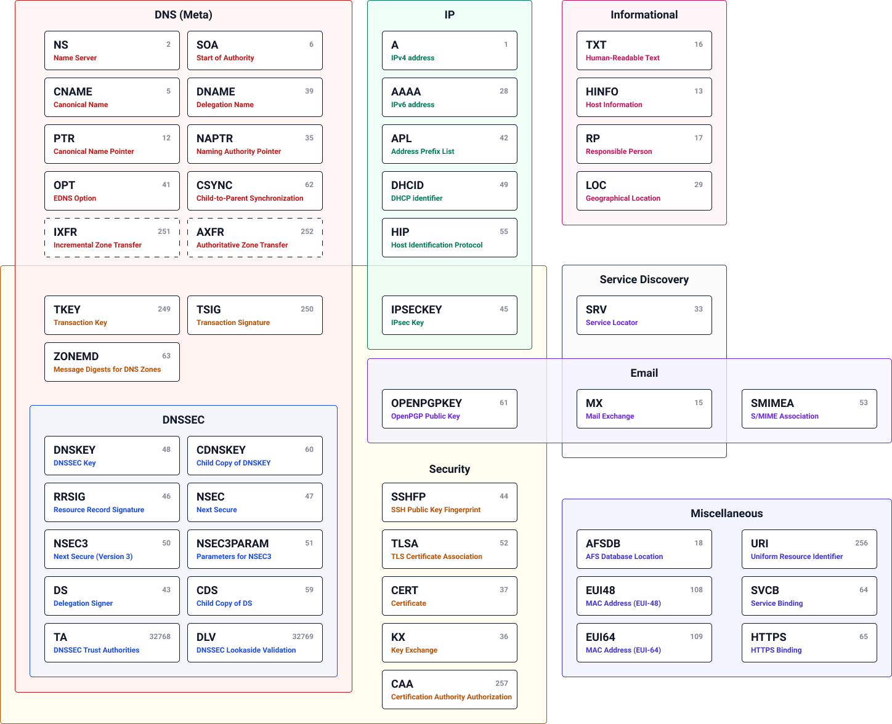

# INFORMATION GATHERING

First step in any penetration test. Collect al possible information of a company, website or any system.

- Passive gathering:
    - IP adressess
    - DNS information
    - Domain names
    - Email adressess
    - Web technologies
    - Subdomains
- Active gathering:
    - Open ports
    - Internal infraestructure
    - Enumerating information from systems

Passive recognition
======================

Gather information without engaging with the target

## Manual website recon and foot printing

Collect all data possible: IP addresses, name, phones, other type of information...

1. **IP address**:

   Sometimes webs have proxy or firewall like cloudfare. If website it is behind a proxy we could have two or more Ips. We can perform a "traceroute" or a "ping" to each IP address to determine which one shows a more direct route to the web server. The IP address with the shortest route and the fewest hops is usually the real web server's IP.

    ```
    host <website>

    traceroute

    ping
    ```

4. **Look for files**:

    - /robots.txt: list of directories that are not indexed by search engines
  
    - /sitemap.xml, /sitemaps.xml: authors, categories, list of all the pages on a website that the website owner wants search engines to index

5. **Plugins**
    
    - Wappalyzer

    ```
    builtWith
    ```

6. **Terminal commands**:

    ```
    whatweb
    ```

7. **Source code web**:

    To analyze source code and structure of website:
    
    ```
    webhttrack
    ```

## Whois enumeration

Internet protocol for querying databases, domain names, ip address block, ... 

To obtain nameserver, actual owner, other personal data, ... we can use:

```
whois
```

## Netcraft

Domain information, web technologies, user data... all information that previously we obtained manually. SSL, TFL vulnerabilities, trackers on the web

<https://sitereport.netcraft.com/>

## DNS Recon

**DNS**: protocol used to resolve hostnames to IP adressess.

**DNS Servers**: servers that contains hostnames and their corresponding IP adresses. 

**DNS Recon**: Process of gathering information about a domain. It includes the following methodologies:

- **Discovering DNS Servers**: Identifying the DNS servers responsible for resolving domain names for a target network.

- **Enumeration**: Enumerating DNS records to gather information such as subdomains, mail servers, and other DNS resource records (A, AAAA, MX, TXT, etc.) that can be useful for mapping the target's network and potential attack vectors.

**DNS records**: Are essential components of the DNS infrastructure that provide information.  Each DNS record type serves a specific purpose and contains different types of information. 




Here are some common DNS record types:
 
- A: hostname to IPv4

- AAAA: domain to ipv6

- NS: name server

- MX: mail server

- CName: alias

- TXT: text record

- SOA: domain authority

- SRV: service

- PTR: ip to hostname

More dns information with:
  
- Dnsdumpster: hosts graphs. <https://dnsdumpster.com/>

```
dnsrecon -d <domain name>
dnsrecon -d <domain name> -a #AXFR query
dnsrecon -d <domain name> -a -j <output file .json>
```

## WAF

**WAF**: Web Applicaiton Firewall

**Notes:**

- With `wafw00f` use -a for testing all waf instances.

A fingerprinting tool that analyzes WAF solutions is wafw00f, identifies if web is protected by firewall or WAF and which WAF is using. 

```
wafw00f -a
```

## Subdomain enumeration

**Notes:**

- Using -e to specify search engines with `sublist3r`.
- The command sublist3r has the option of doing bruteforce attacks or passive recognition.

```
sublist3r
```

## Google dorks

**Google dorks**: search queries that use advanced operators to find specific information on the internet. The most important ones:

- site:

- site:*.

- inurl:admin

- intitle:admin

- intitle:index off

- cache: last versions

- waybackmachine: screenshots of website in the past

- inurl:auth_user_file.txt

- inurl:passwd.txt

- Google Hacking Database

## Email harvesting

When looking for exposed mail address, hosts and IPs. 

**Notes:**
- Using -b for certain search engine with `thHarvester`.

```
theHarvester
```

## Leaked passwords databases

When emails are found we can check if credentials have been leaked with:

- <https://haveibeenpwned.com/>


Active recognition
==================

Activaly engaging with the target.

## DNS Zone Transfers

**DNS Zones files**: contains records for a particulary domain.

**Zone transfer**: transfer dns records from a server to another one, an attacker can copy the primary dns zone files to another one. 

**Tool**:

- <https://zonetransfer.me>


For zone transfer and bruteforce attacks:

```
dnsenum <domain>
dnsenum <domain> -o <output file>
```

When looking for hostnames, ips addresses, domain names in a dns server:

`sudo vim /etc/host `

When looking for default nameserver for the host machine:

`cat /etc/resolv.conf`

Another dns look up utility:

`dig `

For zone transfer attacks:

```
dig axfr @<domain>
dig -x <IP> #reverse lookup on the IP
dig -x <IP> +short
fierce -dns
```

**Metasploit**
```
use auxiliary/gather/enum_dns
    set ENUM_BRU true #bruteforcing subdomains
```


## Host discovery with Nmap

After indetifying my IP use nmap for host discovery.

**Notes:**

- Use -sn option with nmap to avoid port scan and only look for hosts

```
nmap -sn <url>

sudo netdiscover
```

## Port Scanning with nmap

The following options are the most common ones:

- `-sn`: no port scan

- `-Pn:` for windows host so they don't block ping request

- `-p-` : tcp port range

- `-p` <port,port>: specify port or ports

- `-F`: fast scan with 100 top ports

- `-sU`: udp port scanning

- `-v`: display info on whats happening on the background

- `-sV`: service detection

- `-O`: operating system detection

- `-sC`: scripts on the open ports to identify more information

- `A`: scripts, servide detectation and operating system

- `T0-T5`: slower-faster, higher more noise

- `-oN` <file>: output

- `-oX` <file>: for metasploit
