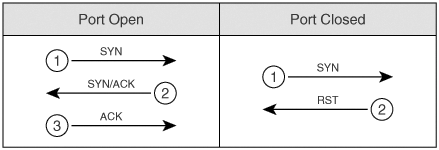
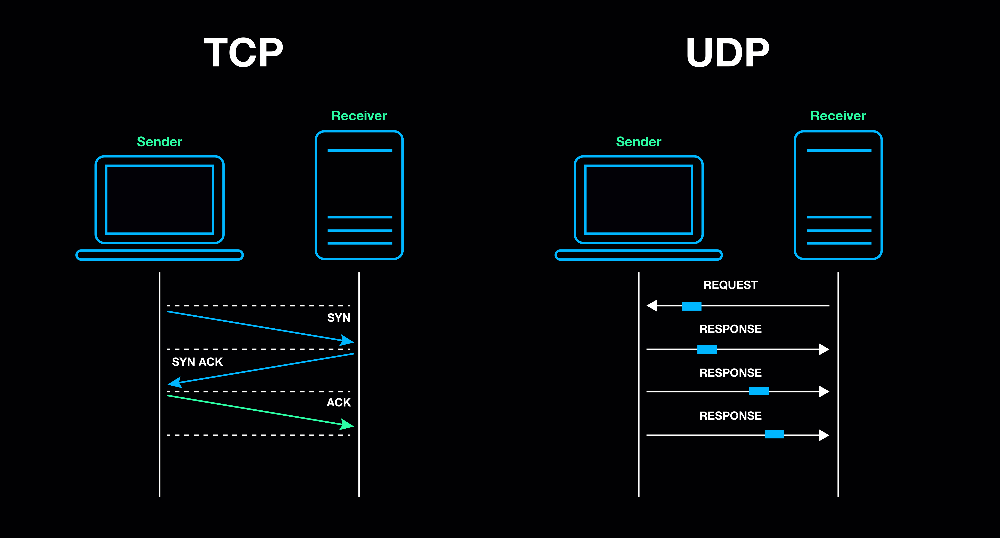

# Footprinting and scanning

## Mapping a network

- Physical access: physical security, OSINT, social engineering.
- Sniffing: passive, watch network traffic (wireshark)
- ARP: address resolution protocol, map ip address to mac addresses.
- ICMP: internet control message protocol, diagnose network issues.

**Notes:**
- `ping` sends echo request.
- `fping` is like ping but for multiple hosts.
- `zenmap` is GUI version of nmap.
- If `arp` finds a host and `ping` doesn’t it is ok, we have to use both to be sure host is up.
- When using -a in `fping` we only want alive connections
- If we dont want errors to show we can use `2>/dev/null`

```
ip a
ifconfig
ipconfig /all
arp-scan
traceroute
ping
fping
nmap
zenmap
```
```
fping -I tap0 -g <subnet> -a 
fping -I tap0 -g <subnet> -a 2>/dev/null 
```

## Port scanning

- Identify operating systems: port scanners like nmap uses the following information to obtain operating systems:
    - Signatures: check signature database
    - Services: send requests and examine responses.
- Identify services: try to connect to ports and check for responses
- Use nmap script `--script=discovery`

**Transport protocols**:
- TCP (Transmission Control Protocol): it establishes a connection between the sender and receiver before data exchange begins 
    - 3 way handshake
- UDP (User Datagram Protocol):  it does not establish a connection before data transfer

- TCP open vs closed port



- TCP vs UDP



## Windows recon

- **BIND ISC**: DNS Server port 177
- **SNMP**: network management protocol used to monitor and manage network devices.
- **TFTP**:  Trivial File Transfer Protocol, operates over **UDP**, is designed for transferring files between systems on a network

```
tftp <ip> <port>
    $tftp > status
```
