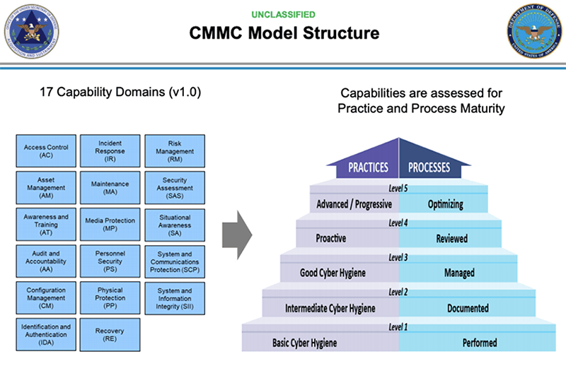
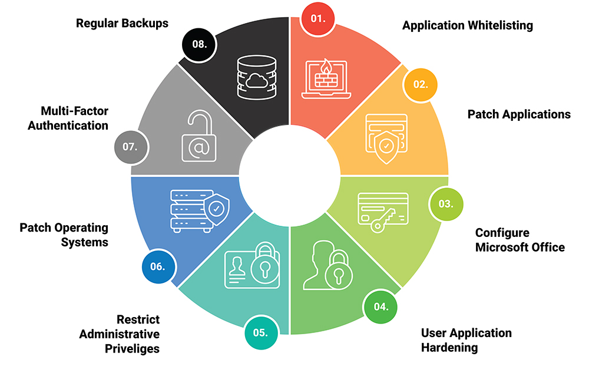

**CIA Triad**:
- Confidenciality
- Integrity
- Availability

##  Regulations
- PCI DSS (Payment Card Industry Data Security Standard): cards brands, created to increase controls around cardholder data to reduce credit card fraud
- HIPAA (Health Insurance Portability and Accountability Act): US regulation related to Protected Health Information. 
    - Administrative Safeguards
    - Physical Safeguards
    - Technical Safeguards
- GDPR (General Data Protection Regulation): data portection and privacy law in Europe to control the process of personal data following certain principles.
- CPPA (California Consumer Privacy Act): created to enhance privacy rights and consumer protection for residents of California 
- SOX(Sarbanes-Oxley Act): US fedeeral law mandates certain practices in financial record keeping and reporting like strong internal control processes that house the financial information that flows into its financial reports in order to enable them to make time disclosures to the public if a breach were to ocur.

## Frameworks
- ISO/IEC 27000: International Organization for Standardization and the International Electrotechnical Comission
    - 27001: information technology, security techniques, information security management systems and requirements 
    - 27002: code of practice for information security controls
- COBIT: Control Objectives for Information and Related Technologies created by ISACA for IT management and IT governance. Defines a set of generic processes for the management of IT
- NIST: National Institute of Standards and Technology catalog of security and privacy controls for all US. NIST 800-53B provides set of baseline security controls and privacy controls for information systems and organizations.
- CIS Controls and CIS Benchmarks: center for internet security with a set of 18 safeguards to mitigate the most prevalent cyber attacks.
- CMMC CyberSecurity Maturity Model Certification progarm of US to verify the maduration levels (5 levels) 

- ASD Essentials 8: Australian Cyber Security Centre Essential 8 madurity model helps organizations to protect Microsoft Windows based attacks and various cyber threats

