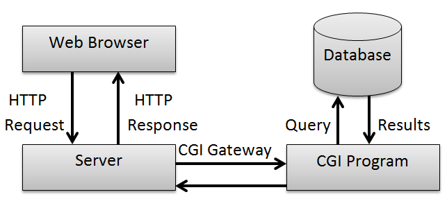
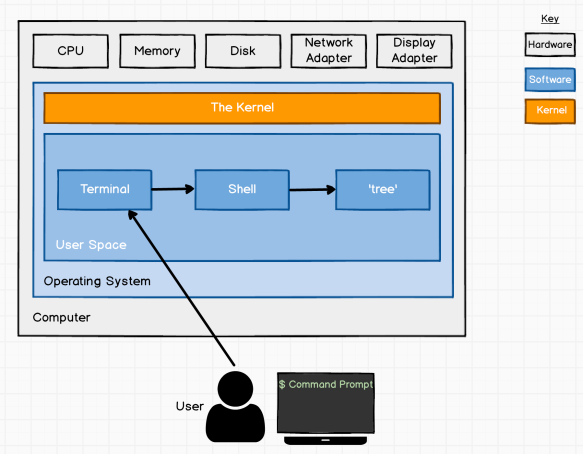

# SYSTEM AND HOST BASED ATTACKS

Attacks that are targeted towards a specific system or host running a specific operating system.

Comes in play after gaining access to a target network.

Focused on misconfigurations and inherent vulnerabilities on the target OS.

## WINDOWS


- C programming language

**Severe vulnerabilitites** over the last 15 years:
- Conflicker MS08-67
- EternalBlue MS17-010
    - Windows versions: windows Vista, 7, 8.1, 10, Server 2008, 2012, 2016
    - **Tools**: AutoBlue, metasploit
- BlueKeep
    - Windows versions: Vista, 2008 & R2, XP, 7
    - **Tools**: metasploit


Types of **Windows vulnerabilities**:
- Information disclosure
- Buffer overflow
- Remote code execution
- Privilege escalation
- Denial of service

Windows has native services and protocols that an attacker can utilize as an access vector to gain access to a target host. Most frequently exploited services are:

- Microsoft IIS
- WebDAV
- SMB
- RDP
- WinRM

MICROSOFT IIS
=============
Extensible software used to host websites and web apps.

**Port**: 80/443

Supports .asp, .aspx, .config, .php

WEBDAV
======

Extension of http protocol that allows users to edit and manage files on remote web servers.

Runs on top of Microsoft IIS.

Requires username and password authentication.

**Steps for exploitation**:
1. Identifying Microsoft IIS Server
2. Brute force authentication attacks:
    - `davtest`
3. Upload files
    - `cadaver`

**Ports**: 80/443

SMB
===

File sharing protocol to share files and peripherrals in a local network.

**Port**: 139 or 445 on top of NetBIOS

**SAMBA**: allows windows to access linux shares and devices

- **User authentication**: username and password
- **Share authentication**: password

**PsExec**: network protocol that allows remote access of a computer with a command line interface. Authentication is made via SMB.

**Steps for exploitation**:

1. Brute force with username and password/password hashes
    - `enum4linux`
    - `hydra`
    - `smbmap`
    - `metasploit`
2. Execution of arbitrary commands

RDP
===

GUI remote access oriticik to connect and interact with Windows system.

**Port**: 3389 or any TCP port

Authentication is made with username and password.

WINRM
=====

Remote management protocol to facilitate remote access to windows systems over HTTP(S)

**Ports**: 5985/5986 and 443

**Steps for exploitation**:
- Tools: `crackmapexec`, `evil-winrm`

PRIVILEGE ESCALATION
====================

Major determinant in pentest.

## Windows kernel

Core program that has complete control of resources and hardware. Translation layes between hardware and software.

- User mode: limited access to system resources and functionality
- Kernel mode: unrestricted access

**Tools**: `Windows-Exploit-Suggester` and `Windows-Kernel-Exploits`

## UAC

User account crontrol used to ensure that changes in the operating system require approval from the administrator or user from administrator local group. A non privilege user will be prompt with a program that asks for admin credentials.

**Steps for exploiting**:
1. Access with a user account of local administrator group
2. **Tool**: `UACMe`

## Tokens

Created and managed by LSASS. Provides to users with access to a system resource without having to provide credential each time a process is started. Generated by winlogon.exe with a indetity and privileges and then attach to child process with userinit.exe.

- **Impersonate tokens**: can be used to impersonate a token on the local system
- **Delegate tokens**: can be used to impersonate a token on any system

Privileges needed to impersonation attacks:
- SeAssignPrimaryToken
- SeCreateToken
- SeImpersonatePrivilege


**Tool**: `metasploit with - Incognito`

## ADS

Alternate Data Streams designed to provide compatibility with MacOS HFS. Contains Data Stream and Resource stream metadata. Can be used to hide malicious code.

## Hashes

Process of converting a piece of data into another values. Hashes are stored in lsass.exe process.

- LM: in windows prior to NT 4.0, breaks password in two, convert them to uppercase and then hash it with DES algoritm
- NTLM: protocols to facilitate authentication with username and passwords. Uses MD4 hash algorithm.

**Tools**: `mimikatz`, `metasploit` (Kiwi)

**Pass-The-Hash attacks**: `metasploit`, `crackmapexec`

## SAM

Database file managing user accounts and passwords. All passwords are hashed in SAM databases. It cannot be copied when system is running. It is needed in memory techniques to dump SAM hashes.

## Configurations files

Unattendeed windows setupt utility automate mass installation and deployments of windws. It also automate repetitive tasks. Utilizes configuration files that contains user accounts credentials.

- C:\System\Panther\Unattend.xml
- C:\System\Panther\Autounattend.xml


## LINUX

Free and open source operating system which is composed of Linux kernel and GNU toolkit, which is a collection of software.

There are specific services and protocols typically found in linu that provide an attacker with an access vector:

- Apache web server
- FTP
- SSH
- SAMBA

Shellshock
==========

Famous vulnerability in the Bash shell v1.3 that allows remote execution. Bash is the default shell for most Linux distributions.

Apache web servers are configured to run CGI, interface to run scripts on Linux systems and displays the output to the client.





**Steps for exploitation**:

1. Locate script that allows us to communicate with bash (.sh, .cgi).
2. `nmap --script http-shellchock --script-args "http-shellshock.uri=<path to script>"`
3. Look for exploits in github
4. Metasploit module

FTP
===

File transfer protocol used to share files between a server and clients. Authentication is made with username and password.

**Port**:21

- In some cases anonymous access is possible.
- **Tools**: `ftp`, `hydra`, `nmap --script ftp-brute`, `nmap --script ftp-anon`

```
use exploit/unix/ftp/proftpd_133c_backdoor
use post/linux/gather/hashdump
use auxiliary/analyze/crack_linux
```

SSH
===

Secure Shell used for remote access to servers and systems

**Port**: 22 or any other TCP port

Two type of authentication:
- User and password
- Key based authentication

**Tools**: `metasploit`

SAMBA
=====

Linux implementation of SMB. Tools are more information in SMB and enumeration module.

**Tools**: `smbmap`, `smbclient`, `metasploit`, `enum4linux`

PRIVILEGE ESCALATION
============

##  Kernel exploits

Tool: Linux-Exploit-Suggester

## Cron jobs

- **Cron** is a utility that runs applications, scripts and other on a specific schedule (task scheduuling). Cron can be used to automate an repeat tasks. 

- **Cron Job**: When an app or script is configured to run repeatedly with Cron.  

- **Crontab**: is a configuration file to store and track Cron jobs. Any script run by cron job will run as the root user. 

**Steps for exploitation**:

1. We will need to find cron jobs scheduled or files being processed by cron jobs. If we find a file that is being modified every minute then it is probably a file being processed by a cron job.
2. Move the following command (or similar that allows you to elevate privileges) to the script:
```
printf '#! /bin/bash/necho "<user> ALL=NOPASSWD:ALL" >> /etc/sudoers`> <path to script cron file>'
```

## SUID Binaries

In addition of the three main permissions (read, write, execute)  linux has also a specialized permission call **SUID, Set Owner User ID**.

This permissions provides users to execute scripts or binaries with the permissions of the files owner but limited to the execution itself.

**Steps for exploitation**:

1. Be the owner of the SUID binary or have executable permissions. Find this with `ls -l` and a file with "s" permission and to check the type with `type <>`.
2. If it is calling another binary remove it and copy the following: `cp /bin/bash <binary>`


## Hashes

In linux multiple users can access simultaneously in a system. Al the information for all accounts is stored in the passwd file: `/etc/passwd`accessible by any user. In this file passwrods are encrypted. All the encrypted passwords can be found in `/etc/shadow´ that onlu root account can access.

In passwd files there are different hashes:
- $1: md4
- $2: blowfish
- $5: sha-256
- $6: sha-512


