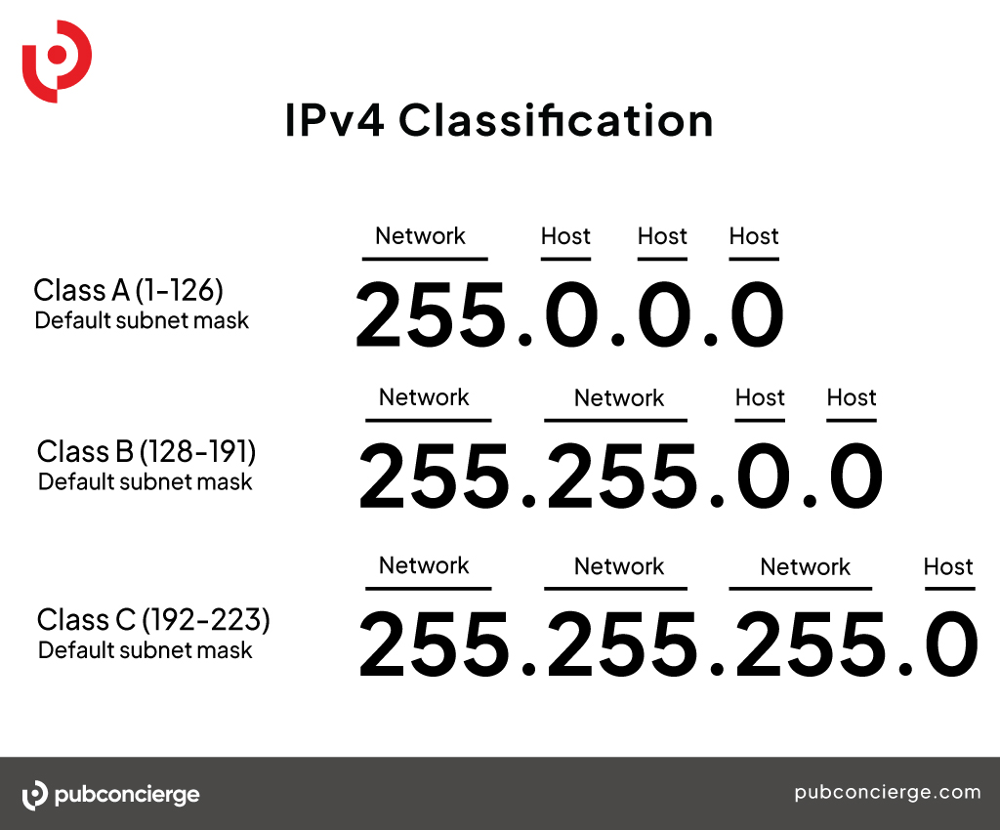

# Network services

- ARP: used to map an IP address to a physical MAC address on a local network. It enables devices to find each other on the same network by resolving IP addresses to MAC addresses
- DHCP: network service that automatically assigns IP addresses, subnet masks, gateways, and other network configuration parameters to devices on a network
- SMB: network protocol used for file and printer sharing in Windows-based networks.
- FTP: network protocol for transferring files between a client and a server on a network
- Telnet: enables users to log in to remote systems and run commands as if they were physically present at the remote location.
- SSH: secure network protocol for secure remote access and data communication. It provides encrypted communication between a client and a server.

**ARP Spoofing**

Attack that manipulates the ARP (Address Resolution Protocol) tables on a local network. The primary goal of this attack is to intercept or redirect network traffic between two hosts, which can allow the attacker to eavesdrop on or modify the communication between them.

1. Configure your Linux system to act as a router between two networks, allowing packets from one network to be forwarded to the other. 

`echo 1 > /proc/sys/net/ipv4/ip_forward`

2. Send false ARP information to the victim, tricking them into assuming that the our MAC address corresponds to a specific IP address. 

`arpspoof -i <ethernet through which attack will be performed> -t <IP address of the victim > -r < IP address you want the victim to believe is the default gateway>`

3. Open Wireshark an apply telnet filter to view telnet traffic
4. Follow TCP stream
5. Look if telnet credentials are mentioned in the TCP stream
6. Log in to the telnet server `telnet <ip>`

## Interface confiuration ifconfig/ ipconfig

Physical or virtual network connections your system has.

Each interface has a state, it can be "UP" (active) or "DOWN" (inactive).

MAC (Media Access Control) Addresses are unique hardware addresses associated with each network interface.

Gateway is the device used to access other networks.

Subnet Masks is typically expressed as /XX. It determines the network's size and scope. The netmask is used to divide an IP address into two parts: the network part and the host part. The network part is constant for all devices on the same network, while the host part varies to identify individual devices within that network.

- The loopback interface is a virtual network interface on a device that is used for local communications on the machine itself. This interface always has the IP address 127.0.0.1.
- Broadcasting is a method of communication on a network in which a message is sent to all machines on the network. The message is sent to the broadcast address, and all devices on the network receive it and can process it.
- Multicast is a method of communication on a network in which a message is sent to a select group of devices, rather than all devices on the network.
- ethX: ethernet network
- wlanX: wireless networks