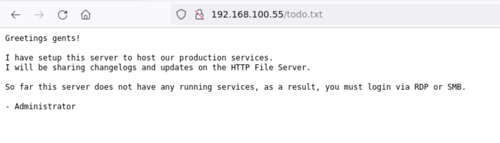

**Local IP**: 192.168.100.5 - Linux


**Hosts in my network**:

192.168.100.1 - linux

192.168.0.2 - Linux

192.168.100.50 - Windows

192.168.100.51 - Windows

192.168.100.52 - Linux

192.168.100.55 - Windows

192.168.100.63 - Windows

192.168.100.67 - Linux

-------------------------
**SERVERS**

192.168.100.1 - puerto 80 filtrado

192.168.100.5 - puerto 80 filtrado

192.168.0.2 - puerto 80 filtrado

192.168.100.50 - apache WINSERVER-01

192.168.100.51 - microsoft iis WINSERVER-02

192.168.100.52 - apche

192.168.100.55 - microsoft iis WINSERVER-03 - no flag en Users

192.168.100.63 - puerto 80 filtrado

192.168.100.67 - puerto 80 cerrado

### NMAP SCAN 

- localhost


- 192.168.100.1

- 192.168.100.5 - localhost

```
PORT     STATE SERVICE
22/tcp   open  ssh
3389/tcp open  ms-wbt-server
5910/tcp open  cm
```

- 192.168.100.50: Windows, Windows Server 2008 R2 - 2012; CPE: cpe:/o:microsoft:windows

    **Wordpress**

    smb **admin:superman**
```
[+]     Administrator:500:aad3b435b51404eeaad3b435b51404ee:5c4d59391f656d5958dab124ffeabc20:::
[+]     mike:1009:aad3b435b51404eeaad3b435b51404ee:c7bad7d1cc2f3c69adea5ccb429234ad:::
[+]     vince:1010:aad3b435b51404eeaad3b435b51404ee:c9b30a86acaea990bf9fa6c35ac9dd92:::
[+]     admin:1011:aad3b435b51404eeaad3b435b51404ee:72f5cfa80f07819ccbcfb72feb9eb9b7:::
```
    Windows NT WINSERVER-01 6.3 build 9600 (Windows Server 2012 R2 Standard Edition) AMD64 
    PHP Version 7.4.26
    These are your folders in c:/wamp64/www
    To use them as an http link, you must declare them as VirtualHost


```
80/tcp    open  http               Apache httpd 2.4.51 ((Win64) PHP/7.4.26)
135/tcp   open  msrpc              Microsoft Windows RPC
139/tcp   open  netbios-ssn        Microsoft Windows netbios-ssn
445/tcp   open  microsoft-ds       Microsoft Windows Server 2008 R2 - 2012 microsoft-ds
3389/tcp  open  ssl/ms-wbt-server?
49152/tcp open  msrpc              Microsoft Windows RPC
49153/tcp open  msrpc              Microsoft Windows RPC
49154/tcp open  msrpc              Microsoft Windows RPC
49155/tcp open  msrpc              Microsoft Windows RPC
49156/tcp open  msrpc              Microsoft Windows RPC
```


```
root@kali:~# dirb http://192.168.100.50/phpmyadmin

-----------------
DIRB v2.22    
By The Dark Raver
-----------------

START_TIME: Sun Nov 19 17:50:53 2023
URL_BASE: http://192.168.100.50/phpmyadmin/
WORDLIST_FILES: /usr/share/dirb/wordlists/common.txt

-----------------

GENERATED WORDS: 4612                                                          

---- Scanning URL: http://192.168.100.50/phpmyadmin/ ----
+ http://192.168.100.50/phpmyadmin/atom (CODE:301|SIZE:0)                                                                                   
+ http://192.168.100.50/phpmyadmin/aux (CODE:403|SIZE:289)                                                                                  
+ http://192.168.100.50/phpmyadmin/changelog (CODE:200|SIZE:49416)                                                                          
+ http://192.168.100.50/phpmyadmin/ChangeLog (CODE:200|SIZE:49416)                                                                          
+ http://192.168.100.50/phpmyadmin/com1 (CODE:403|SIZE:289)                                                                                 
+ http://192.168.100.50/phpmyadmin/com2 (CODE:403|SIZE:289)                                                                                 
+ http://192.168.100.50/phpmyadmin/com3 (CODE:403|SIZE:289)                                                                                 
+ http://192.168.100.50/phpmyadmin/composer (CODE:200|SIZE:4064)                                                                            
+ http://192.168.100.50/phpmyadmin/con (CODE:403|SIZE:289)                                                                                  
==> DIRECTORY: http://192.168.100.50/phpmyadmin/doc/                                                                                        
==> DIRECTORY: http://192.168.100.50/phpmyadmin/examples/                                                                                   
+ http://192.168.100.50/phpmyadmin/favicon.ico (CODE:200|SIZE:22486)                                                                        
==> DIRECTORY: http://192.168.100.50/phpmyadmin/feed/                                                                                       
+ http://192.168.100.50/phpmyadmin/index (CODE:200|SIZE:19810)                                                                              
+ http://192.168.100.50/phpmyadmin/Index (CODE:200|SIZE:19810)                                                                              
+ http://192.168.100.50/phpmyadmin/index.php (CODE:200|SIZE:19810)                                                                          
==> DIRECTORY: http://192.168.100.50/phpmyadmin/js/                                                                                         
==> DIRECTORY: http://192.168.100.50/phpmyadmin/libraries/                                                                                  
+ http://192.168.100.50/phpmyadmin/license (CODE:200|SIZE:18092)                                                                            
+ http://192.168.100.50/phpmyadmin/LICENSE (CODE:200|SIZE:18092)                                                                            
==> DIRECTORY: http://192.168.100.50/phpmyadmin/locale/                                                                                     
+ http://192.168.100.50/phpmyadmin/lpt1 (CODE:403|SIZE:289)                                                                                 
+ http://192.168.100.50/phpmyadmin/lpt2 (CODE:403|SIZE:289)                                                                                 
+ http://192.168.100.50/phpmyadmin/nul (CODE:403|SIZE:289)                                                                                  
+ http://192.168.100.50/phpmyadmin/package (CODE:200|SIZE:2252)                                                                             
+ http://192.168.100.50/phpmyadmin/print (CODE:200|SIZE:1034)                                                                               
+ http://192.168.100.50/phpmyadmin/prn (CODE:403|SIZE:289)                                                                                  
+ http://192.168.100.50/phpmyadmin/rdf (CODE:301|SIZE:0)                                                                                    
+ http://192.168.100.50/phpmyadmin/readme (CODE:200|SIZE:1520)                                                                              
+ http://192.168.100.50/phpmyadmin/Readme (CODE:200|SIZE:1520)                                                                              
+ http://192.168.100.50/phpmyadmin/README (CODE:200|SIZE:1520)                                                                              
+ http://192.168.100.50/phpmyadmin/robots (CODE:200|SIZE:26)                                                                                
+ http://192.168.100.50/phpmyadmin/robots.txt (CODE:200|SIZE:26)                                                                            
+ http://192.168.100.50/phpmyadmin/rss (CODE:301|SIZE:0)                                                                                    
+ http://192.168.100.50/phpmyadmin/rss2 (CODE:301|SIZE:0)                                                                                   
==> DIRECTORY: http://192.168.100.50/phpmyadmin/setup/                                                                                      
+ http://192.168.100.50/phpmyadmin/sitemap.xml (CODE:302|SIZE:0)                                                                            
==> DIRECTORY: http://192.168.100.50/phpmyadmin/sql/                                                                                        
==> DIRECTORY: http://192.168.100.50/phpmyadmin/SQL/                                                                                        
==> DIRECTORY: http://192.168.100.50/phpmyadmin/templates/                                                                                  
==> DIRECTORY: http://192.168.100.50/phpmyadmin/themes/                                                                                     
==> DIRECTORY: http://192.168.100.50/phpmyadmin/Themes/                                                                                     
==> DIRECTORY: http://192.168.100.50/phpmyadmin/tmp/                                                                                        
==> DIRECTORY: http://192.168.100.50/phpmyadmin/TMP/                                                                                        
+ http://192.168.100.50/phpmyadmin/url (CODE:302|SIZE:0)                                                                                    
==> DIRECTORY: http://192.168.100.50/phpmyadmin/vendor/                                                                                     
                                                                                                                                            
---- Entering directory: http://192.168.100.50/phpmyadmin/doc/ ----
(!) WARNING: Directory IS LISTABLE. No need to scan it.                        
    (Use mode '-w' if you want to scan it anyway)
                                                                                                                                            
---- Entering directory: http://192.168.100.50/phpmyadmin/examples/ ----
(!) WARNING: Directory IS LISTABLE. No need to scan it.                        
    (Use mode '-w' if you want to scan it anyway)
                                                                                                                                            
---- Entering directory: http://192.168.100.50/phpmyadmin/feed/ ----
==> DIRECTORY: http://192.168.100.50/phpmyadmin/feed/atom/                                                                                  
+ http://192.168.100.50/phpmyadmin/feed/feed (CODE:301|SIZE:0)                                                                              
+ http://192.168.100.50/phpmyadmin/feed/index.php (CODE:301|SIZE:0)                                                                         
==> DIRECTORY: http://192.168.100.50/phpmyadmin/feed/rdf/                                                                                   
+ http://192.168.100.50/phpmyadmin/feed/rss (CODE:301|SIZE:0)                                                                               
+ http://192.168.100.50/phpmyadmin/feed/rss2 (CODE:301|SIZE:0)                                                                              
+ http://192.168.100.50/phpmyadmin/feed/sitemap.xml (CODE:302|SIZE:0)                                                                       
                                                                                                                                            
---- Entering directory: http://192.168.100.50/phpmyadmin/js/ ----
(!) WARNING: Directory IS LISTABLE. No need to scan it.                        
    (Use mode '-w' if you want to scan it anyway)
                                                                                                                                            
---- Entering directory: http://192.168.100.50/phpmyadmin/libraries/ ----
(!) WARNING: Directory IS LISTABLE. No need to scan it.                        
    (Use mode '-w' if you want to scan it anyway)
                                                                                                                                            
---- Entering directory: http://192.168.100.50/phpmyadmin/locale/ ----
(!) WARNING: Directory IS LISTABLE. No need to scan it.                        
    (Use mode '-w' if you want to scan it anyway)
                                                                                                                                            
---- Entering directory: http://192.168.100.50/phpmyadmin/setup/ ----
+ http://192.168.100.50/phpmyadmin/setup/atom (CODE:301|SIZE:0)                                                                             
+ http://192.168.100.50/phpmyadmin/setup/aux (CODE:403|SIZE:289)                                                                            
+ http://192.168.100.50/phpmyadmin/setup/com1 (CODE:403|SIZE:289)                                                                           
+ http://192.168.100.50/phpmyadmin/setup/com2 (CODE:403|SIZE:289)                                                                           
+ http://192.168.100.50/phpmyadmin/setup/com3 (CODE:403|SIZE:289)                                                                           
+ http://192.168.100.50/phpmyadmin/setup/con (CODE:403|SIZE:289)                                                                            
+ http://192.168.100.50/phpmyadmin/setup/config (CODE:303|SIZE:0)                                                                           
==> DIRECTORY: http://192.168.100.50/phpmyadmin/setup/feed/                                                                                 
+ http://192.168.100.50/phpmyadmin/setup/index (CODE:200|SIZE:1002)                                                                         
+ http://192.168.100.50/phpmyadmin/setup/Index (CODE:200|SIZE:1002)                                                                         
+ http://192.168.100.50/phpmyadmin/setup/index.php (CODE:200|SIZE:1002)                                                                     
==> DIRECTORY: http://192.168.100.50/phpmyadmin/setup/lib/                                                                                  
+ http://192.168.100.50/phpmyadmin/setup/lpt1 (CODE:403|SIZE:289)                                                                           
+ http://192.168.100.50/phpmyadmin/setup/lpt2 (CODE:403|SIZE:289)                                                                           
+ http://192.168.100.50/phpmyadmin/setup/nul (CODE:403|SIZE:289)                                                                            
+ http://192.168.100.50/phpmyadmin/setup/prn (CODE:403|SIZE:289)                                                                            
+ http://192.168.100.50/phpmyadmin/setup/rdf (CODE:301|SIZE:0)                                                                              
+ http://192.168.100.50/phpmyadmin/setup/rss (CODE:301|SIZE:0)                                                                              
+ http://192.168.100.50/phpmyadmin/setup/rss2 (CODE:301|SIZE:0)                                                                             
+ http://192.168.100.50/phpmyadmin/setup/sitemap.xml (CODE:302|SIZE:0)                                                                      
+ http://192.168.100.50/phpmyadmin/setup/styles (CODE:200|SIZE:10109)                                                                       
                                                                                                                                            
---- Entering directory: http://192.168.100.50/phpmyadmin/sql/ ----
(!) WARNING: Directory IS LISTABLE. No need to scan it.                        
    (Use mode '-w' if you want to scan it anyway)
                                                                                                                                            
---- Entering directory: http://192.168.100.50/phpmyadmin/SQL/ ----
(!) WARNING: Directory IS LISTABLE. No need to scan it.                        
    (Use mode '-w' if you want to scan it anyway)
                                                                                                                                            
---- Entering directory: http://192.168.100.50/phpmyadmin/templates/ ----
(!) WARNING: Directory IS LISTABLE. No need to scan it.                        
    (Use mode '-w' if you want to scan it anyway)
                                                                                                                                            
---- Entering directory: http://192.168.100.50/phpmyadmin/themes/ ----
(!) WARNING: Directory IS LISTABLE. No need to scan it.                        
    (Use mode '-w' if you want to scan it anyway)
                                                                                                                                            
---- Entering directory: http://192.168.100.50/phpmyadmin/Themes/ ----
(!) WARNING: Directory IS LISTABLE. No need to scan it.                        
    (Use mode '-w' if you want to scan it anyway)
                                                                                                                                            
---- Entering directory: http://192.168.100.50/phpmyadmin/tmp/ ----
(!) WARNING: Directory IS LISTABLE. No need to scan it.                        
    (Use mode '-w' if you want to scan it anyway)
                                                                                                                                            
---- Entering directory: http://192.168.100.50/phpmyadmin/TMP/ ----
(!) WARNING: Directory IS LISTABLE. No need to scan it.                        
    (Use mode '-w' if you want to scan it anyway)
                                                                                                                                            
---- Entering directory: http://192.168.100.50/phpmyadmin/vendor/ ----
(!) WARNING: Directory IS LISTABLE. No need to scan it.                        
    (Use mode '-w' if you want to scan it anyway)
                                                                                                                                            
---- Entering directory: http://192.168.100.50/phpmyadmin/feed/atom/ ----
+ http://192.168.100.50/phpmyadmin/feed/atom/atom (CODE:301|SIZE:0)                                                                         
+ http://192.168.100.50/phpmyadmin/feed/atom/feed (CODE:301|SIZE:0)                                                                         
+ http://192.168.100.50/phpmyadmin/feed/atom/index.php (CODE:301|SIZE:0)                                                                    
+ http://192.168.100.50/phpmyadmin/feed/atom/rdf (CODE:301|SIZE:0)                                                                          
+ http://192.168.100.50/phpmyadmin/feed/atom/rss (CODE:301|SIZE:0)                                                                          
+ http://192.168.100.50/phpmyadmin/feed/atom/rss2 (CODE:301|SIZE:0)                                                                         
+ http://192.168.100.50/phpmyadmin/feed/atom/sitemap.xml (CODE:302|SIZE:0)                                                                  
                                                                                                                                            
---- Entering directory: http://192.168.100.50/phpmyadmin/feed/rdf/ ----
+ http://192.168.100.50/phpmyadmin/feed/rdf/atom (CODE:301|SIZE:0)                                                                          
+ http://192.168.100.50/phpmyadmin/feed/rdf/feed (CODE:301|SIZE:0)                                                                          
+ http://192.168.100.50/phpmyadmin/feed/rdf/index.php (CODE:301|SIZE:0)                                                                     
+ http://192.168.100.50/phpmyadmin/feed/rdf/rdf (CODE:301|SIZE:0)                                                                           
+ http://192.168.100.50/phpmyadmin/feed/rdf/rss (CODE:301|SIZE:0)                                                                           
+ http://192.168.100.50/phpmyadmin/feed/rdf/rss2 (CODE:301|SIZE:0)                                                                          
+ http://192.168.100.50/phpmyadmin/feed/rdf/sitemap.xml (CODE:302|SIZE:0)                                                                   
                                                                                                                                            
---- Entering directory: http://192.168.100.50/phpmyadmin/setup/feed/ ----
==> DIRECTORY: http://192.168.100.50/phpmyadmin/setup/feed/atom/                                                                            
+ http://192.168.100.50/phpmyadmin/setup/feed/feed (CODE:301|SIZE:0)                                                                        
+ http://192.168.100.50/phpmyadmin/setup/feed/index.php (CODE:301|SIZE:0)                                                                   
==> DIRECTORY: http://192.168.100.50/phpmyadmin/setup/feed/rdf/                                                                             
+ http://192.168.100.50/phpmyadmin/setup/feed/rss (CODE:301|SIZE:0)                                                                         
+ http://192.168.100.50/phpmyadmin/setup/feed/rss2 (CODE:301|SIZE:0)                                                                        
+ http://192.168.100.50/phpmyadmin/setup/feed/sitemap.xml (CODE:302|SIZE:0)                                                                 
                                                                                                                                            
---- Entering directory: http://192.168.100.50/phpmyadmin/setup/lib/ ----
(!) WARNING: Directory IS LISTABLE. No need to scan it.                        
    (Use mode '-w' if you want to scan it anyway)
                                                                                                                                            
---- Entering directory: http://192.168.100.50/phpmyadmin/setup/feed/atom/ ----
+ http://192.168.100.50/phpmyadmin/setup/feed/atom/atom (CODE:301|SIZE:0)                                                                   
+ http://192.168.100.50/phpmyadmin/setup/feed/atom/feed (CODE:301|SIZE:0)                                                                   
+ http://192.168.100.50/phpmyadmin/setup/feed/atom/index.php (CODE:301|SIZE:0)                                                              
+ http://192.168.100.50/phpmyadmin/setup/feed/atom/rdf (CODE:301|SIZE:0)                                                                    
+ http://192.168.100.50/phpmyadmin/setup/feed/atom/rss (CODE:301|SIZE:0)                                                                    
+ http://192.168.100.50/phpmyadmin/setup/feed/atom/rss2 (CODE:301|SIZE:0)                                                                   
+ http://192.168.100.50/phpmyadmin/setup/feed/atom/sitemap.xml (CODE:302|SIZE:0)                                                            
                                                                                                                                            
---- Entering directory: http://192.168.100.50/phpmyadmin/setup/feed/rdf/ ----
+ http://192.168.100.50/phpmyadmin/setup/feed/rdf/atom (CODE:301|SIZE:0)                                                                    
+ http://192.168.100.50/phpmyadmin/setup/feed/rdf/feed (CODE:301|SIZE:0)                                                                    
+ http://192.168.100.50/phpmyadmin/setup/feed/rdf/index.php (CODE:301|SIZE:0)                                                               
+ http://192.168.100.50/phpmyadmin/setup/feed/rdf/rdf (CODE:301|SIZE:0)                                                                     
+ http://192.168.100.50/phpmyadmin/setup/feed/rdf/rss (CODE:301|SIZE:0)                                                                     
+ http://192.168.100.50/phpmyadmin/setup/feed/rdf/rss2 (CODE:301|SIZE:0)                                                                    
+ http://192.168.100.50/phpmyadmin/setup/feed/rdf/sitemap.xml (CODE:302|SIZE:0) 
```

- 192.168.100.51: Windows, Windows Server 2008 R2 - 2012; CPE: cpe:/o:microsoft:windows

```
21/tcp    open  ftp                Microsoft ftpd
| ftp-anon: Anonymous FTP login allowed (FTP code 230)
| 04-19-22  02:25AM       \<DIR>          aspnet_client
| 04-19-22  01:19AM                 1400 cmdasp.aspx
| 04-19-22  12:17AM                99710 iis-85.png
| 04-19-22  12:17AM                  701 iisstart.htm
|_04-19-22  02:13AM                   22 robots.txt.txt


80/tcp    open  http               Microsoft IIS httpd 8.5
135/tcp   open  msrpc              Microsoft Windows RPC
139/tcp   open  netbios-ssn        Microsoft Windows netbios-ssn
445/tcp   open  microsoft-ds       Microsoft Windows Server 2008 R2 - 2012 microsoft-ds
3389/tcp  open  ssl/ms-wbt-server?
49152/tcp open  msrpc              Microsoft Windows RPC
49153/tcp open  msrpc              Microsoft Windows RPC
49154/tcp open  msrpc              Microsoft Windows RPC
49155/tcp open  msrpc              Microsoft Windows RPC
49156/tcp open  msrpc              Microsoft Windows RPC
```


- 192.168.100.52: IP-192-168-100-52; OSs: Unix, Linux; CPE: cpe:/o:linux:linux_kernel

    **Drupal site**
    **User**: admin , admin@syntex.com
    Drupal version 7.57
    dbadmin:sayang
    ftp:ftp
```
root hash: root:$6$v8b2/P8T26uEUwvM$TBiao8o1dfqQrGPPcebRj6A6cNiixcy6/r/AFtN5Swk7N1kpg/8UyQK0pXFwdLfy5Ed/71VN91nJ6.3JyAN/00:18998:0:99999:7:::
```


```
    |   0 |          |                                                         |                      |       |           | NULL             |          0 |          0 |          0 |      0 | NULL             |          |       0 |                      | NULL |
|   1 | admin    | $S$D67i0qFmSLMLwZ9PU7VEocSS9fvV1JaSeJxQMgCid80hGbq6wXZH | admin@syntex.com     |       |           | NULL             | 1650232322 | 1650248652 | 1650248498 |      1 | America/New_York |          |       0 | admin@syntex.com     | b:0; |
|   2 | auditor  | $S$DV.wsqkmKY3y5VW.icW/g5NTU3h.UA01nxqL9Cro27GaSBYpH4WC | auditor@syntex.com   |       |           | filtered_html    | 1650234408 |          0 |          0 |      1 | America/New_York |          |       0 | auditor@syntex.com   | b:0; |
|   3 | dbadmin  | $S$DZcGD5qcb6xso1E/Mu6DJP4uPi5DfY28kBEyuIab8Pod1saBaImN | dbadmin@syntex.com   |       |           | filtered_html    | 1650248436 |          0 |          0 |      1 | America/New_York |          |       0 | dbadmin@syntex.com   | b:0; |
|   4 | Vincenzo | $S$DGnS.dK3q2FeWeNbLikdI5Hk/XdBFI2jBFkmPvv/v9Ln8vjIanIu | vincenzo@syntext.com |       |           | filtered_html    | 1650248490 |          0 |          0 |      1 | America/New_York |          |       0 | vincenzo@syntext.com | b:0; |
```


```
21/tcp   open  ftp           vsftpd 3.0.3
| ftp-anon: Anonymous FTP login allowed (FTP code 230)
|_-rw-r--r--    1 65534    65534         318 Apr 18  2022 updates.txt
22/tcp   open  ssh           OpenSSH 8.2p1 Ubuntu 4ubuntu0.3 (Ubuntu Linux; protocol 2.0)
80/tcp   open  http          Apache httpd 2.4.41
139/tcp  open  netbios-ssn   Samba smbd 3.X - 4.X (workgroup: WORKGROUP)
445/tcp  open  netbios-ssn   Samba smbd 3.X - 4.X (workgroup: WORKGROUP)
3306/tcp open  mysql         MySQL 5.5.5-10.3.34-MariaDB-0ubuntu0.20.04.1
3389/tcp open  ms-wbt-server xrdp
```

- 192.168.100.55: Windows, Windows Server 2008 R2 - 2012; CPE: cpe:/o:microsoft:windows

```
oot@kali:~# dirb http://192.168.100.55

-----------------
DIRB v2.22    
By The Dark Raver
-----------------

START_TIME: Sun Nov 19 19:23:03 2023
URL_BASE: http://192.168.100.55/
WORDLIST_FILES: /usr/share/dirb/wordlists/common.txt

-----------------

GENERATED WORDS: 4612                                                          

---- Scanning URL: http://192.168.100.55/ ----
==> DIRECTORY: http://192.168.100.55/webdav/                                                                                                
                                                                                                                                            
---- Entering directory: http://192.168.100.55/webdav/ ----
                                                                                                                                            
-----------------
END_TIME: Sun Nov 19 19:23:10 2023
DOWNLOADED: 9224 - FOUND: 0

```


```
smbclient //192.168.100.55/Users -U lawrence
```

    [445][smb] host: 192.168.100.55   login: lawrence   password: computadora
    mary:hotmama
    admin:blanca

```
80/tcp   open  http          Microsoft IIS httpd 10.0
135/tcp  open  msrpc         Microsoft Windows RPC
139/tcp  open  netbios-ssn   Microsoft Windows netbios-ssn
445/tcp  open  microsoft-ds  Microsoft Windows Server 2008 R2 - 2012 microsoft-ds
3389/tcp open  ms-wbt-server Microsoft Terminal Services
```
- 192.168.100.63: Windows; CPE: cpe:/o:microsoft:windows
```
3389/tcp open  ms-wbt-server Microsoft Terminal Services
```
- 192.168.100.67: Linux; CPE: cpe:/o:linux:linux_kernel
```
22/tcp open  ssh     OpenSSH 8.2p1 Ubuntu 4ubuntu0.7 (Ubuntu Linux; protocol 2.0)
```


